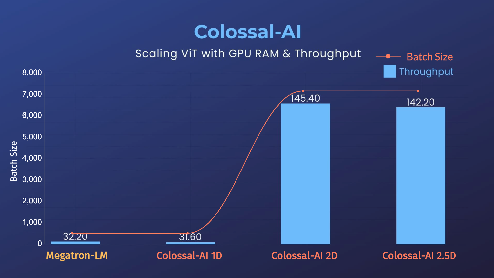
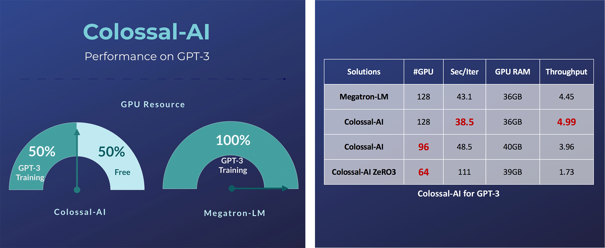
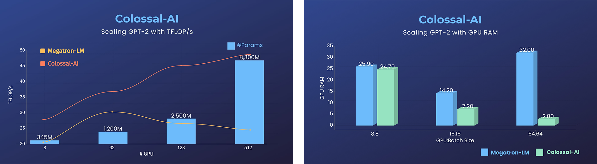
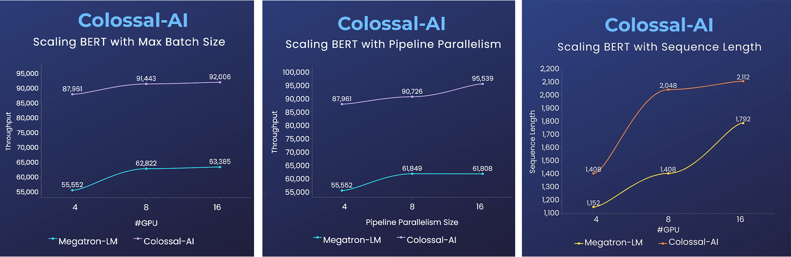

# Colossal-AI

[](https://www.colossalai.org/)

<div align="center">
   <h3> <a href="https://arxiv.org/abs/2110.14883"> Paper </a> | 
   <a href="https://www.colossalai.org/"> Documentation </a> | 
   <a href="https://github.com/hpcaitech/ColossalAI-Examples"> Examples </a> |   
   <a href="https://github.com/hpcaitech/ColossalAI/discussions"> Forum </a> | 
   <a href="https://medium.com/@hpcaitech"> Blog </a></h3> 
   <br/>

   [](https://github.com/hpcaitech/ColossalAI/actions/workflows/PR_CI.yml)
   [](https://colossalai.readthedocs.io/en/latest/?badge=latest)
   [](https://codebeat.co/projects/github-com-hpcaitech-colossalai-main)

   | [English](README.md) | [中文](README-zh-Hans.md) |
</div>
An integrated large-scale model training system with efficient parallelization techniques.


## Features

Colossal-AI provides a collection of parallel training components for you. We aim to support you to write your
distributed deep learning models just like how you write your single-GPU model. We provide friendly tools to kickstart
distributed training in a few lines.

- Data Parallelism
- Pipeline Parallelism
- 1D, 2D, 2.5D, 3D tensor parallelism
- Sequence parallelism
- Friendly trainer and engine
- Extensible for new parallelism
- Mixed Precision Training
- Zero Redundancy Optimizer (ZeRO)

## Examples
### ViT



- 14x larger batch size
- 5x faster training

### GPT-3



- Free 50% GPU resources, or 10.7% acceleration for GPT-3

### GPT-2


- 11x lower GPU RAM, or superlinear scaling for GPT-2


### BERT



- 2x faster training
- 50% longer sequence length

Please visit our [documentation and tutorials](https://www.colossalai.org/) for more details.


## Installation

### PyPI

```bash
pip install colossalai
```
This command will install CUDA extension if your have installed CUDA, NVCC and torch. 

If you don't want to install CUDA extension, you should add `--global-option="--no_cuda_ext"`, like:
```bash
pip install colossalai --global-option="--no_cuda_ext"
```

If you want to use `ZeRO`, you can run:
```bash
pip install colossalai[zero]
```

### Install From Source

> The version of Colossal-AI will be in line with the main branch of the repository. Feel free to raise an issue if you encounter any problem. :)

```shell
git clone https://github.com/hpcaitech/ColossalAI.git
cd ColossalAI
# install dependency
pip install -r requirements/requirements.txt

# install colossalai
pip install .
```

If you don't want to install and enable CUDA kernel fusion (compulsory installation when using fused optimizer):

```shell
pip install --global-option="--no_cuda_ext" .
```

## Use Docker

Run the following command to build a docker image from Dockerfile provided.

```bash
cd ColossalAI
docker build -t colossalai ./docker
```

Run the following command to start the docker container in interactive mode.

```bash
docker run -ti --gpus all --rm --ipc=host colossalai bash
```

## Contributing

If you wish to contribute to this project, you can follow the guideline in [Contributing](./CONTRIBUTING.md)


## Quick View

### Start Distributed Training in Lines

```python
import colossalai
from colossalai.utils import get_dataloader


# my_config can be path to config file or a dictionary obj
# 'localhost' is only for single node, you need to specify
# the node name if using multiple nodes
colossalai.launch(
    config=my_config,
    rank=rank,
    world_size=world_size,
    backend='nccl',
    port=29500,
    host='localhost'
)

# build your model
model = ...

# build you dataset, the dataloader will have distributed data
# sampler by default
train_dataset = ...
train_dataloader = get_dataloader(dataset=dataset,
                                shuffle=True
                                )


# build your optimizer
optimizer = ...

# build your loss function
criterion = ...

# initialize colossalai
engine, train_dataloader, _, _ = colossalai.initialize(
    model=model,
    optimizer=optimizer,
    criterion=criterion,
    train_dataloader=train_dataloader
)

# start training
engine.train()
for epoch in range(NUM_EPOCHS):
    for data, label in train_dataloader:
        engine.zero_grad()
        output = engine(data)
        loss = engine.criterion(output, label)
        engine.backward(loss)
        engine.step()

```

### Write a Simple 2D Parallel Model

Let's say we have a huge MLP model and its very large hidden size makes it difficult to fit into a single GPU. We can
then distribute the model weights across GPUs in a 2D mesh while you still write your model in a familiar way.

```python
from colossalai.nn import Linear2D
import torch.nn as nn


class MLP_2D(nn.Module):

    def __init__(self):
        super().__init__()
        self.linear_1 = Linear2D(in_features=1024, out_features=16384)
        self.linear_2 = Linear2D(in_features=16384, out_features=1024)

    def forward(self, x):
        x = self.linear_1(x)
        x = self.linear_2(x)
        return x

```


## Cite Us

```
@article{bian2021colossal,
  title={Colossal-AI: A Unified Deep Learning System For Large-Scale Parallel Training},
  author={Bian, Zhengda and Liu, Hongxin and Wang, Boxiang and Huang, Haichen and Li, Yongbin and Wang, Chuanrui and Cui, Fan and You, Yang},
  journal={arXiv preprint arXiv:2110.14883},
  year={2021}
}
```
