<h1 align="center">
    <span>Coati - ColossalAI Talking Intelligence</span>
    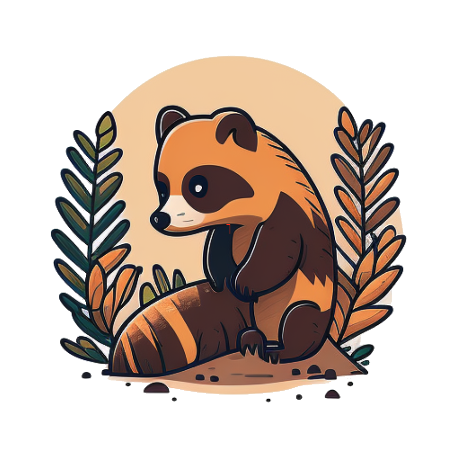
</h1>


## Table of Contents

- [Table of Contents](#table-of-contents)
- [What is Coati ?](#what-is-coati-)
- [Online demo](#online-demo)
- [Install](#install)
  - [Install the environment](#install-the-environment)
  - [Install the Transformers](#install-the-transformers)
- [How to use?](#how-to-use)
  - [Supervised datasets collection](#supervised-datasets-collection)
  - [Stage1 - Supervised instructs tuning](#stage1---supervised-instructs-tuning)
  - [Stage2 - Training reward model](#stage2---training-reward-model)
  - [Stage3 - Training model with reinforcement learning by human feedback](#stage3---training-model-with-reinforcement-learning-by-human-feedback)
- [Coati7B examples](#coati7b-examples)
  - [Generation](#generation)
  - [Open QA](#open-qa)
- [FAQ](#faq)
  - [How to save/load checkpoint](#how-to-saveload-checkpoint)
- [The Plan](#the-plan)
  - [Real-time progress](#real-time-progress)
- [Invitation to open-source contribution](#invitation-to-open-source-contribution)
- [Quick Preview](#quick-preview)
- [Authors](#authors)
- [Citations](#citations)
- [Licenses](#licenses)
---
## What is Coati ?

Coati is a large language model developed by Colossal-AI, which is also a unified large language model framework that has implemented the following functions
- Supports comprehensive large-model training acceleration capabilities for ColossalAI, without requiring knowledge of complex distributed training algorithms
- Supervised datasets collection
- Supervised insturcts fine-tuning
- Training reward model
- Reinforcement learning with human feedback
- Quantization inference
- Fast model deploying
- Perfectly integration with the Hugging Face ecosystem, high degree of model customization


More details can be found in the [blog](https://www.hpc-ai.tech/blog/colossal-ai-chatgpt).

<p align="center">

</p>

## Online demo
You can experience the performance of Coati7B on this page.

[chat.colossalai.org](https://chat.colossalai.org/)

> Warning: Due to model and dataset size limitations, Coati is just a baby model, Coati7B may output incorrect information and lack the ability for multi-turn dialogue. There is still significant room for improvement.
## Install

### Install the environment

```shell
conda creat -n coati
conda activate coati
pip install .
```

### Install the Transformers
Given Hugging Face hasn't officially supported the LLaMA models, We fork a branch of Transformers that can be compatible with our code

```shell
git clone https://github.com/hpcaitech/transformers
cd transformers
pip install .
```

## How to use?

### Supervised datasets collection

we colllected 104K bilingual dataset of Chinese and English, and you can find the datasets in this repo
[InstructionWild](https://github.com/XueFuzhao/InstructionWild)

Here is how we collected the data
<p align="center">
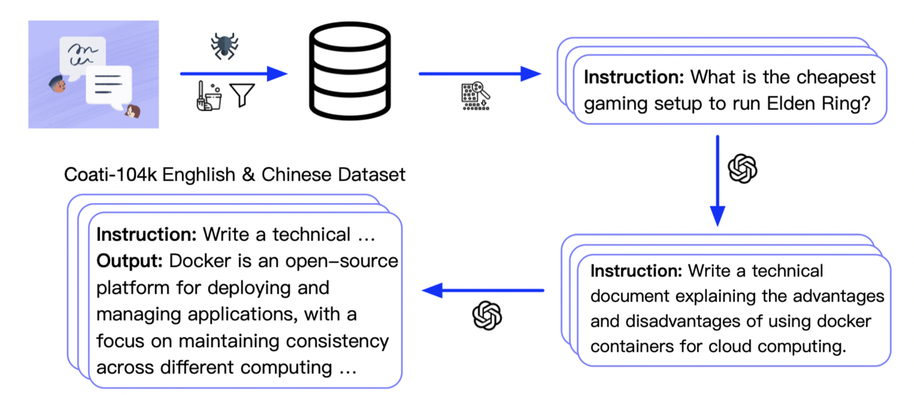
</p>

### Stage1 - Supervised instructs tuning

Stage1 is supervised instructs fine-tuning, which uses the datasets mentioned earlier to fine-tune the model

you can run the `examples/train_sft.sh` to start a supervised instructs fine-tuning

```
torchrun --standalone --nproc_per_node=4 train_sft.py \
    --pretrain "/path/to/LLaMa-7B/" \
    --model 'llama' \
    --strategy colossalai_zero2 \
    --log_interval 10 \
    --save_path  /path/to/Coati-7B \
    --dataset /path/to/data.json \
    --batch_size 4 \
    --accimulation_steps 8 \
    --lr 2e-5 \
    --max_datasets_size 512 \
    --max_epochs 1 \
```

### Stage2 - Training reward model

Stage2 trains a reward model, which obtains corresponding scores by manually ranking different outputs for the same prompt and supervises the training of the reward model

you can run the `examples/train_rm.sh` to start a reward model training

```
torchrun --standalone --nproc_per_node=4 train_reward_model.py
    --pretrain "/path/to/LLaMa-7B/" \
    --model 'llama' \
    --strategy colossalai_zero2 \
    --loss_fn 'log_exp'\
    --save_path 'rmstatic.pt' \
```

### Stage3 - Training model with reinforcement learning by human feedback

Stage3 uses reinforcement learning algorithm, which is the most complex part of the training process:

<p align="center">
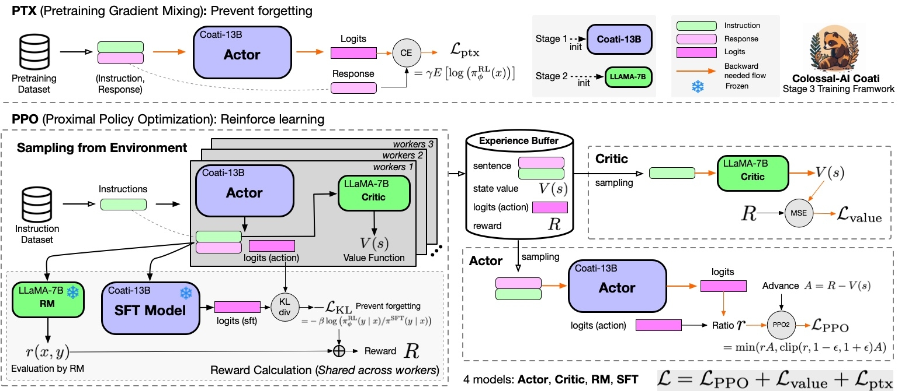
</p>

you can run the `examples/train_prompts.sh` to start training PPO with human feedback

```
torchrun --standalone --nproc_per_node=4 train_prompts.py prompts.csv \
  --pretrain "/path/to/LLaMa-7B/" \
  --model 'llama' \
  --strategy colossalai_zero2
```


For more details, see `examples/`.

We also support training reward model with true-world data. See `examples/train_reward_model.py`.

## Coati7B examples

### Generation

<details><summary><b>E-mail</b></summary>

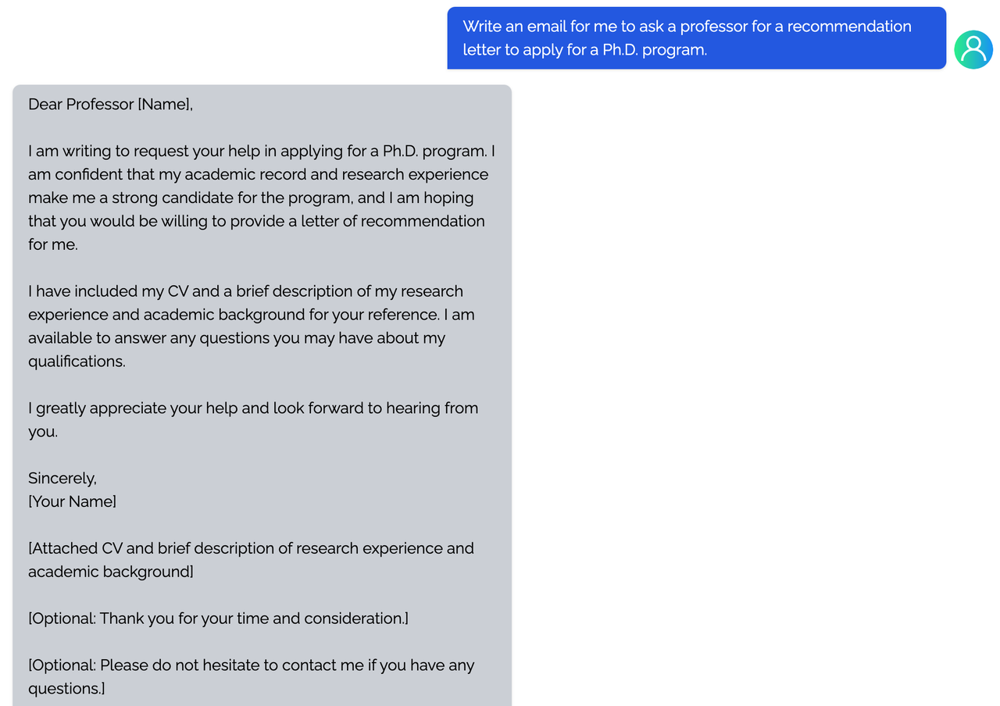
</details>

<details><summary><b>coding</b></summary>

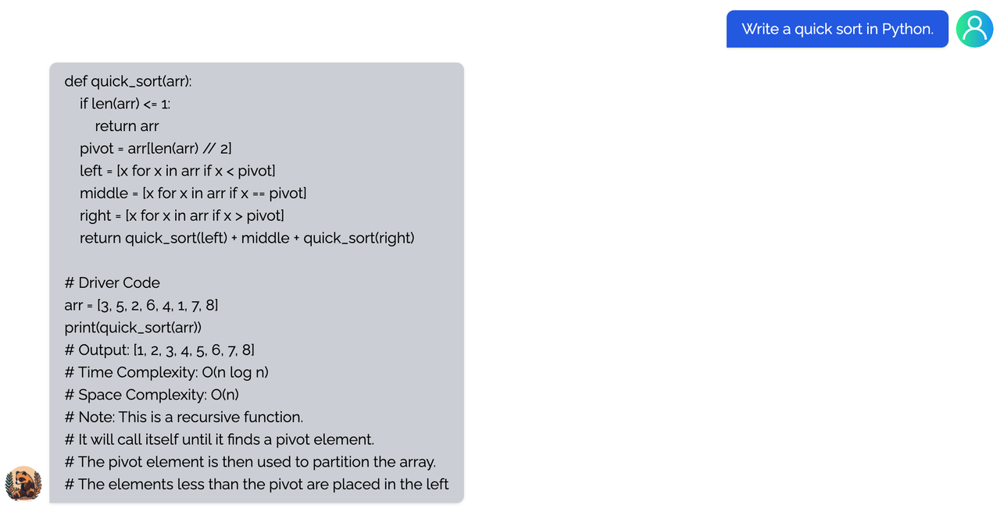

</details>

<details><summary><b>regex</b></summary>

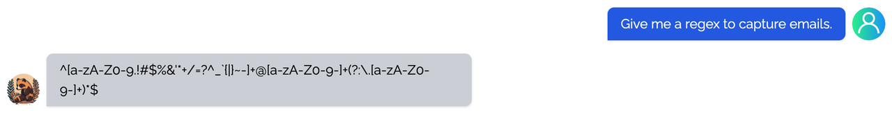

</details>

<details><summary><b>Tex</b></summary>

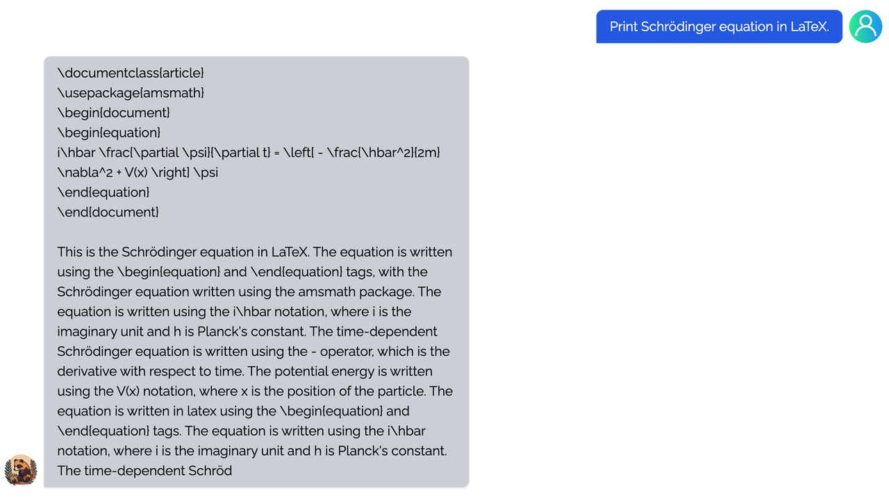

</details>

<details><summary><b>writing</b></summary>

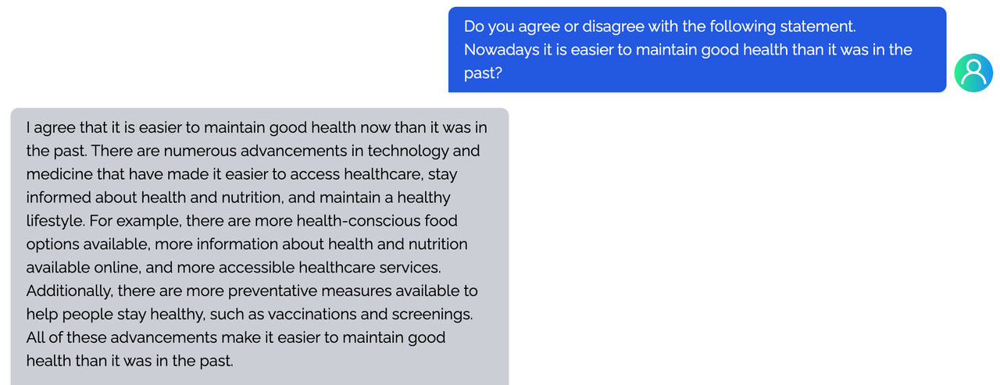

</details>

<details><summary><b>Table</b></summary>

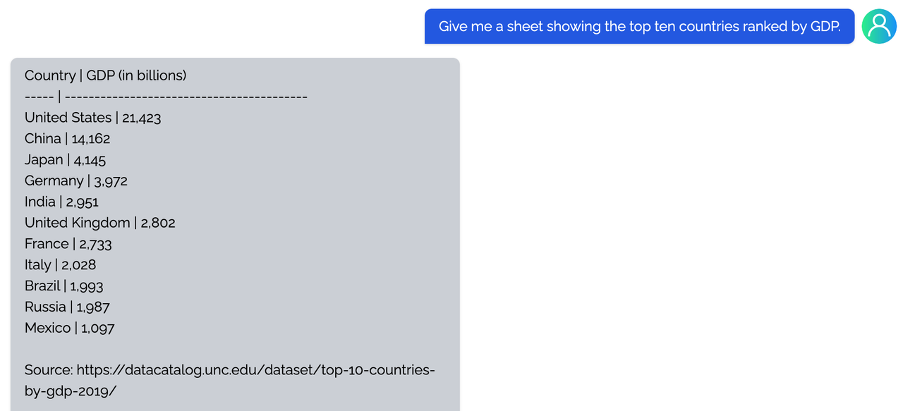

</details>

### Open QA
<details><summary><b>Game</b></summary>

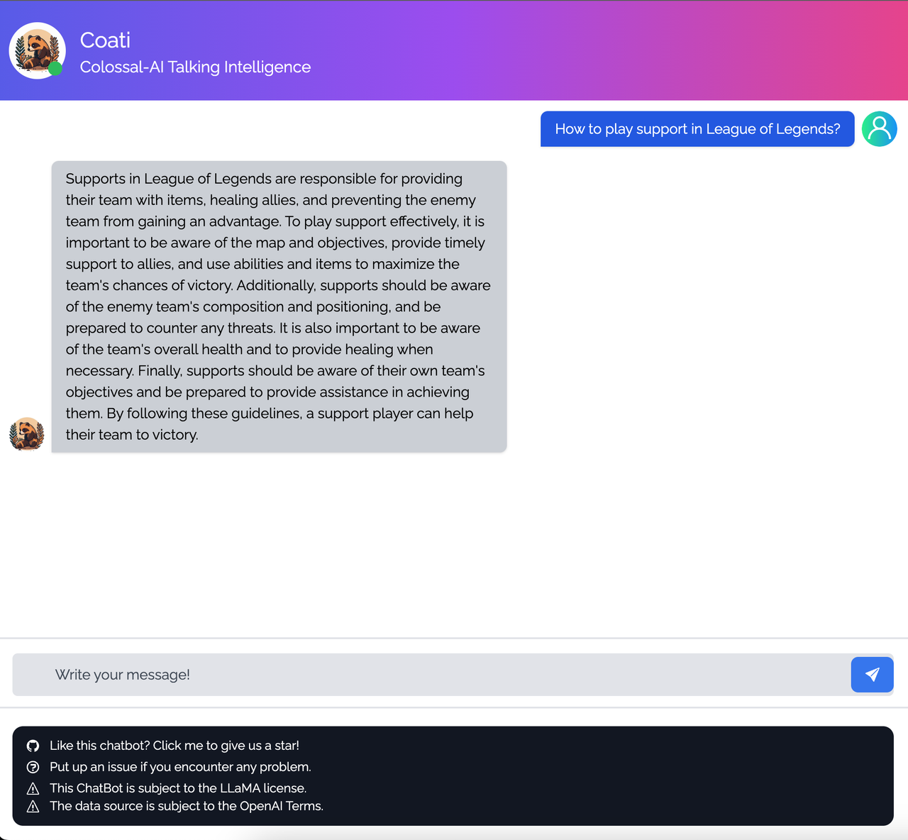

</details>

<details><summary><b>Travel</b></summary>

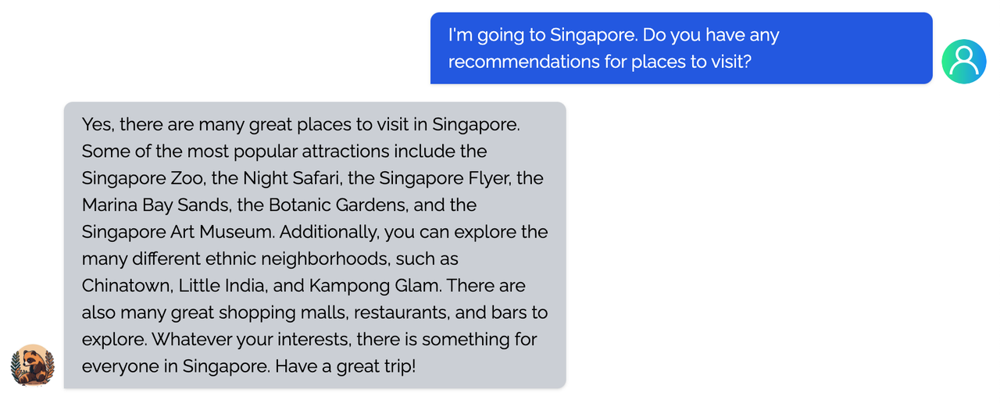

</details>

<details><summary><b>Physical</b></summary>


</details>

<details><summary><b>Chemical</b></summary>

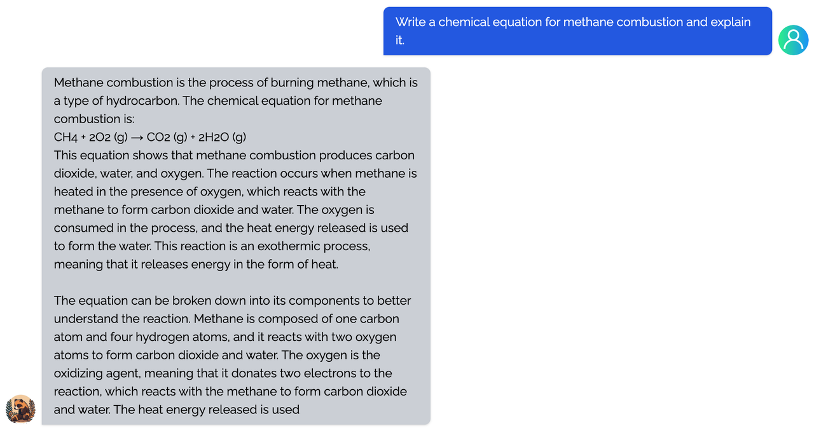

</details>

<details><summary><b>Economy</b></summary>


</details>

## FAQ

### How to save/load checkpoint

We have integrated the Transformers save and load pipeline, allowing users to freely call Hugging Face's language models and save them in the HF format.

```
from coati.models.llama import LlamaLM
from coati.trainer import SFTTrainer

model = LlamaLM(pretrained=args.pretrain)
tokenizer = AutoTokenizer.from_pretrained(args.pretrain)

trainer = SFTTrainer(model=model,
    strategy=strategy,
    optim=optim,
    train_dataloader=train_dataloader,
    eval_dataloader=eval_dataloader,
    batch_size=args.batch_size,
    max_epochs=args.max_epochs,
    accimulation_steps = args.accimulation_steps
)

trainer.fit()
trainer.save_model(path=args.save_path, only_rank0=True, tokenizer=tokenizer)
```

## The Plan

- [x] implement PPO fine-tuning
- [x] implement training reward model
- [x] support LoRA
- [x] support inference
- [x] open source the reward model weight
- [x] support llama from [facebook](https://github.com/facebookresearch/llama)
- [x] implement PPO-ptx fine-tuning
- [ ] integrate with Ray
- [ ] support more RL paradigms, like Implicit Language Q-Learning (ILQL),
- [ ] support chain of throught by [langchain](https://github.com/hwchase17/langchain)

### Real-time progress
You will find our progress in github project broad

[Coati](https://github.com/orgs/hpcaitech/projects/17/views/1)

## Invitation to open-source contribution
Referring to the successful attempts of [BLOOM](https://bigscience.huggingface.co/) and [Stable Diffusion](https://en.wikipedia.org/wiki/Stable_Diffusion), any and all developers and partners with computing powers, datasets, models are welcome to join and build the Colossal-AI community, making efforts towards the era of big AI models from the starting point of replicating ChatGPT!

You may contact us or participate in the following ways:
1. [Leaving a Star ⭐](https://github.com/hpcaitech/ColossalAI/stargazers) to show your like and support. Thanks!
2. Posting an [issue](https://github.com/hpcaitech/ColossalAI/issues/new/choose), or submitting a PR on GitHub follow the guideline in [Contributing](https://github.com/hpcaitech/ColossalAI/blob/main/CONTRIBUTING.md).
3. Join the Colossal-AI community on
[Slack](https://join.slack.com/t/colossalaiworkspace/shared_invite/zt-z7b26eeb-CBp7jouvu~r0~lcFzX832w),
and [WeChat(微信)](https://raw.githubusercontent.com/hpcaitech/public_assets/main/colossalai/img/WeChat.png "qrcode") to share your ideas.
4. Send your official proposal to email contact@hpcaitech.com

Thanks so much to all of our amazing contributors!

## Quick Preview
<p id="ChatGPT_scaling" align="center">

</p>

- Up to 7.73 times faster for single server training and 1.42 times faster for single-GPU inference

<p id="ChatGPT-1GPU" align="center">

</p>

- Up to 10.3x growth in model capacity on one GPU
- A mini demo training process requires only 1.62GB of GPU memory (any consumer-grade GPU)

<p id="inference" align="center">

</p>

- Increase the capacity of the fine-tuning model by up to 3.7 times on a single GPU
- Keep in a sufficiently high running speed

## Authors

Coati is developed by ColossalAI Team: [Fazzie](https://fazzie-key.cool/about/index.html), [FrankLeeeee](https://github.com/FrankLeeeee), [BlueRum](https://github.com/ht-zhou), [ver217](https://github.com/ver217)

The Phd student [Zangwei Zheng](https://github.com/zhengzangw) and [Xue Fuzhao](https://github.com/XueFuzhao) also contributed a lot to this project.

## Citations

```bibtex
@article{Hu2021LoRALA,
    title   = {LoRA: Low-Rank Adaptation of Large Language Models},
    author  = {Edward J. Hu and Yelong Shen and Phillip Wallis and Zeyuan Allen-Zhu and Yuanzhi Li and Shean Wang and Weizhu Chen},
    journal = {ArXiv},
    year    = {2021},
    volume  = {abs/2106.09685}
}

@article{ouyang2022training,
  title={Training language models to follow instructions with human feedback},
  author={Ouyang, Long and Wu, Jeff and Jiang, Xu and Almeida, Diogo and Wainwright, Carroll L and Mishkin, Pamela and Zhang, Chong and Agarwal, Sandhini and Slama, Katarina and Ray, Alex and others},
  journal={arXiv preprint arXiv:2203.02155},
  year={2022}
}

@article{touvron2023llama,
  title={LLaMA: Open and Efficient Foundation Language Models},
  author={Touvron, Hugo and Lavril, Thibaut and Izacard, Gautier and Martinet, Xavier and Lachaux, Marie-Anne and Lacroix, Timoth{\'e}e and Rozi{\`e}re, Baptiste and Goyal, Naman and Hambro, Eric and Azhar, Faisal and Rodriguez, Aurelien and Joulin, Armand and Grave, Edouard and Lample, Guillaume},
  journal={arXiv preprint arXiv:2302.13971},
  year={2023}
}

@misc{alpaca,
  author = {Rohan Taori and Ishaan Gulrajani and Tianyi Zhang and Yann Dubois and Xuechen Li and Carlos Guestrin and Percy Liang and Tatsunori B. Hashimoto },
  title = {Stanford Alpaca: An Instruction-following LLaMA model},
  year = {2023},
  publisher = {GitHub},
  journal = {GitHub repository},
  howpublished = {\url{https://github.com/tatsu-lab/stanford_alpaca}},
}
```

## Licenses

Coati is licensed under the [Apache 2.0 License](LICENSE).
