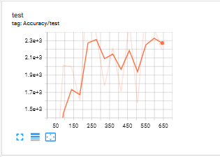
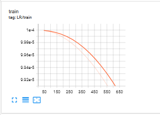

# Overview
Image segmentation aims to segment the picture into different blocks according to the content. Compared with image classification and detection, segmentation is a finer task because each pixel needs to be classified. Similar to the detection model, the semantic segmentation model can be established based on the classification model. For example, we can use the CNN network to extract features for classification. The DeepLab is a model specially designed to deal with semantic segmentation. However, due to the existence of hollow convolution, the computational complexity of DeepLab is higher. A more lightweight segmentation model is needed to meet the needs of low latency scenarios, such as autonomous vehicles.

This is the repository for training DeepLabv3+ based on the CamVid data set for segmentation, which starts the training process using Colossal-AI. The main body of the Encoder in DeepLabv3+ is DCNN with hole convolution. The traditional classification networks such as ResNet, and the spatial pyramid pooling module with hole convolution (Atrous Spatial Pyramid Pooling, ASPP)) can be both used mainly to introduce multi-scale information.
## Requirements
```
python=3.7.11
cuda11.3
cudnn8.0
pytorch 1.10.1
```

## Data
This work supports `from torch.utils.data import Dataset as BaseDataset` as the data feed.

For data preparation, the CamVid([CamVid](http://mi.eng.cam.ac.uk/research/projects/VideoRec/CamVid/)) data set can be downloaded automatically into the specified directory, and the code snippet is shown below

```
git clone https://github.com/alexgkendall/SegNet-Tutorial ./data
```

## Training
There is an example for training deeplabv3 on the CamVid data set.

The following bash commond can be used to run
```
export DATA_PATH=./data/CamVid/

python ./train.py
```
to train the model.

The experiments can also be conducted on Cityscapes ([Cityscapes](https://www.cityscapes-dataset.com/downloads/)) data set.

And do this in training script to train:

```
from dataloader import DataSet
train_dataset = DataSet(args.data)
train_dataloader = torch.utils.data.DataLoader(train_dataset, batch_size=args.batch_size, num_workers=args.worker, drop_last=False, shuffle=True, pin_memory=True)
test_dataset = DataSet(args.data, train=False, input_size=(1024, 2048), mirror=False)
test_dataloader = torch.utils.data.DataLoader(test_dataset, batch_size=args.batch_size, num_workers=1, drop_last=False, shuffle=False, pin_memory=True)
```

## Experiment results
The evaluation of the performance are as follows.




As shown in the figure, the curve of accuracy increase in a large degree at the beginning of the training period. After 200 to 300 epochs, the curve fluctuates within a fixed value range and tends to be converged. Due to the difficulty in large-batch training, there is a decline during the middle of training process. The training loss reduces as the epochs increase. The learning rate is set to be 0.0001, which can further be finetuned for better convergence speed and training efficiency.
