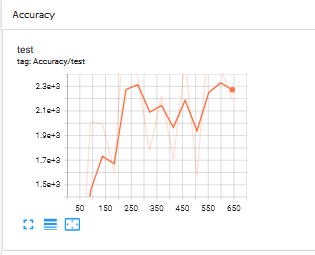
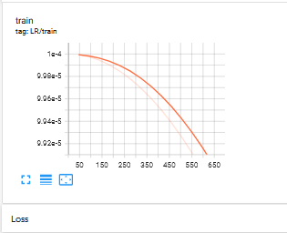

# Train DeepLabv3 on CamVid data set

This is the main repository for training DeepLabv3 based on CamVid data set for segmentation.

## Requirements
```
python=3.7.11
cuda11.3
cudnn8.0
pytorch 1.10.1
```

## Data
This work supports `from torch.utils.data import Dataset as BaseDataset` as the data feed.

The following data is provided as training examples:
Camvid([Training](http://mi.eng.cam.ac.uk/research/projects/VideoRec/CamVid/))

The code snippet is shown below:
```
os.system('git clone https://github.com/alexgkendall/SegNet-Tutorial ./data')
```
Firstly, you need to set the path to store the dataset by setting the environment variable 
```
os.environ['DATA']= './data'
```
The data are downloaded automatically into the specified directory by
```
os.system('git clone https://github.com/alexgkendall/SegNet-Tutorial ./data')
```

## Training
There is an example for training deeplabv3 on the CamVid dataset. 
The experiments also be conducted on other datasets.
Please refer to : [www.cityscapes-dataset.net](www.cityscapes-dataset.net) for cityscapes data set.
Simply run
```
python ./train_mytest.py
```
to train the model.

## Experiment results
The evaluation of the performance are as follows.



