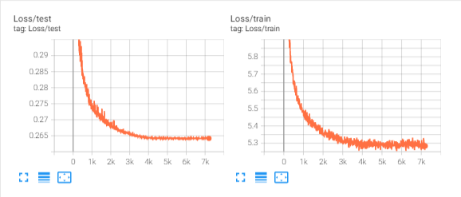
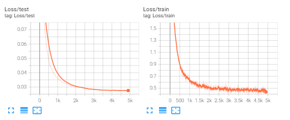
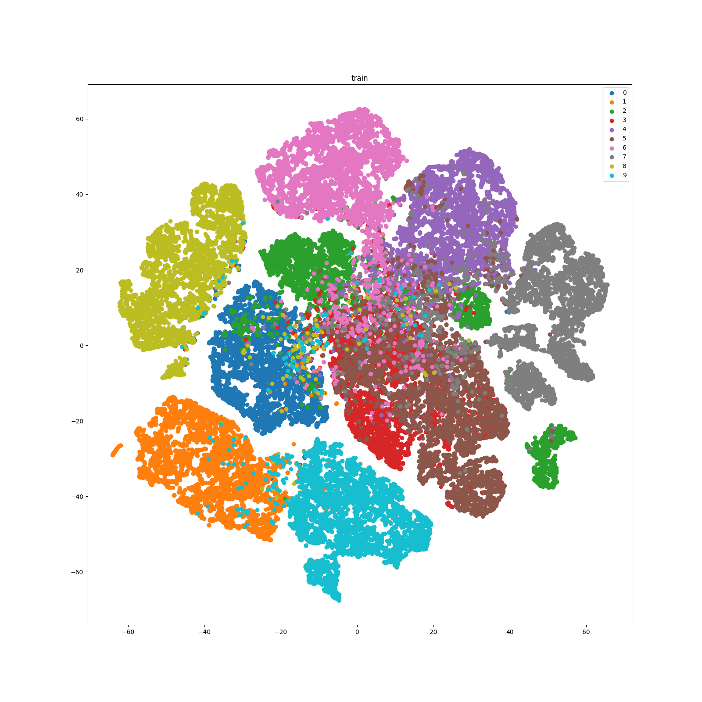
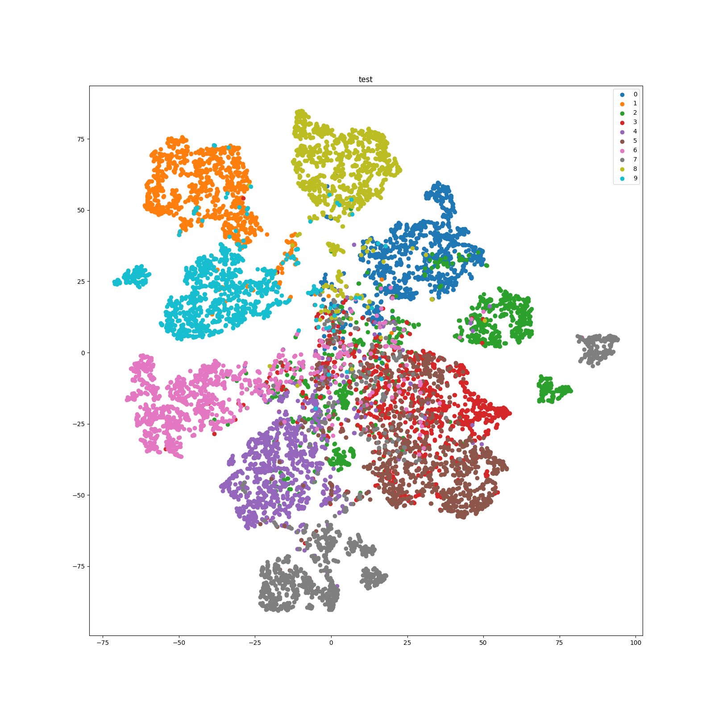

# Overview

Here is an example of applying PreAct-ResNet18 to train SimCLR on CIFAR10. We use 1x RTX 3090 in this example. 

# How to run
Specified in:
```shell
bash train.sh
```

# Results
The loss curve of SimCLR self-supervised training is as follows:

The loss curve of linear evaluation is as follows:

The accuracy curve of linear evaluation is as follows:

The t-SNE of the training set of CIFAR10 is as follows:

The t-SNE of the test set of CIFAR10 is as follows:
