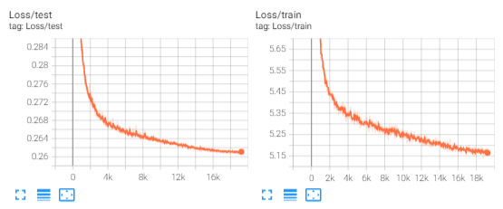
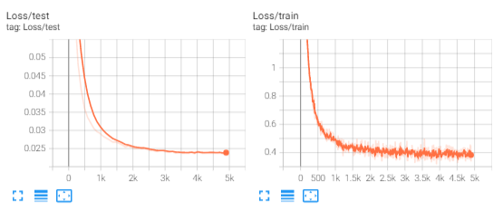
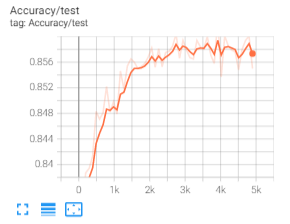
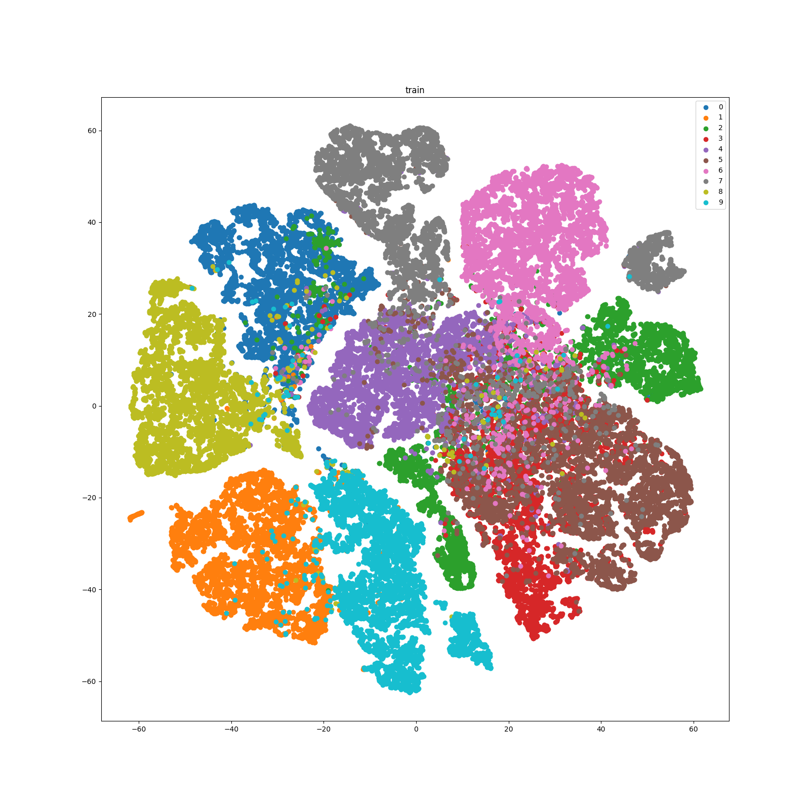
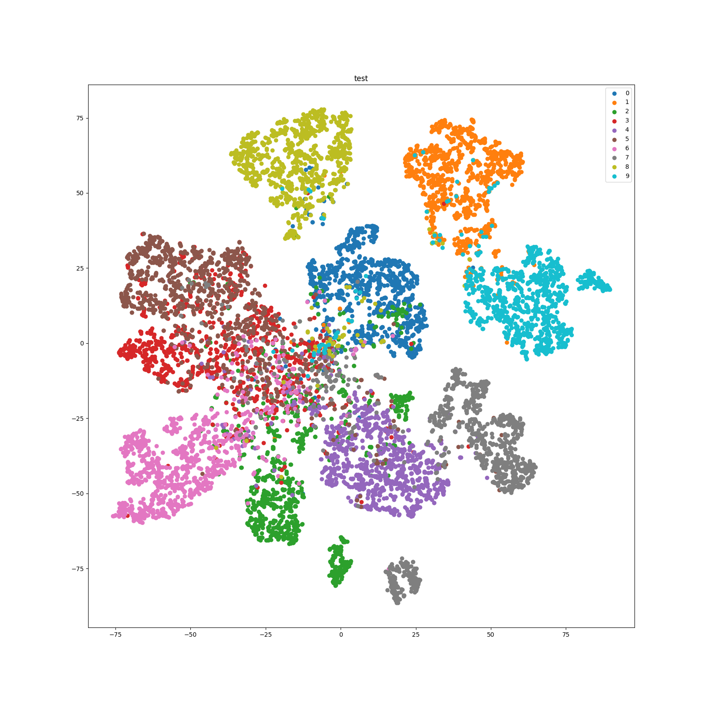

# Overview

Here is an example of applying [PreAct-ResNet18](https://arxiv.org/abs/1603.05027) to train [SimCLR](https://arxiv.org/abs/2002.05709) on CIFAR10. 
SimCLR is a kind of self-supervised representation learning algorithm which learns generic representations of images on an unlabeled dataset. The generic representations are learned by simultaneously maximizing agreement between differently transformed views of the same image and minimizing agreement between transformed views of different images, following a method called contrastive learning. Updating the parameters of a neural network using this contrastive objective causes representations of corresponding views to “attract” each other, while representations of non-corresponding views “repel” each other. A more detailed description of SimCLR is available [here](https://ai.googleblog.com/2020/04/advancing-self-supervised-and-semi.html).  
  
The training process consists of two phases: (1) self-supervised representation learning: the model which acts as a feature extractor is trained exactly as described above; and (2) linear evaluation: to evaluate how well representations are learned, generally a linear classifier is added on top of the trained feature extractor in phase 1. The linear classifier is trained with a labeled dataset in a conventional supervised manner, while parameters of the feature extractor keep fixed. This process is called linear evaluation.  

# How to run
The training commands are specified in:  
```shell
bash train.sh
```  
Before running, you can specify the experiment name (folders with the same name will be created in `ckpt` to save checkpoints and in `tb_logs` to save the tensorboard file) and other training hyperparameters in `config.py`. By default CIFAR10 dataset will be downloaded automatically and saved in `./dataset`. Note that `LOG_NAME` in `le_config.py` should be the same as that in `config.py`.

Besides linear evaluation, you can also visualize the distribution of learned representations. A script is provided which first extracts representations and then visualizes them with [t-SNE](https://scikit-learn.org/stable/modules/generated/sklearn.manifold.TSNE.html). t-SNE is a good tool to visualize high-dimensional data. It converts similarities between data points to joint probabilities and tries to minimize the Kullback-Leibler divergence between the joint probabilities of the low-dimensional embedding and the high-dimensional data. You can directly run the script by (remember modifying `log_name` and `epoch` to specify the model in which experiment folder and of which training epoch to load):
```python 
python visualization.py
```

# Results
The loss curve of SimCLR self-supervised training is as follows:  
  
The loss curve of linear evaluation is as follows:  
  
The accuracy curve of linear evaluation is as follows:  
  
The t-SNE of the training set of CIFAR10 is as follows:  
  
The t-SNE of the test set of CIFAR10 is as follows:  
  