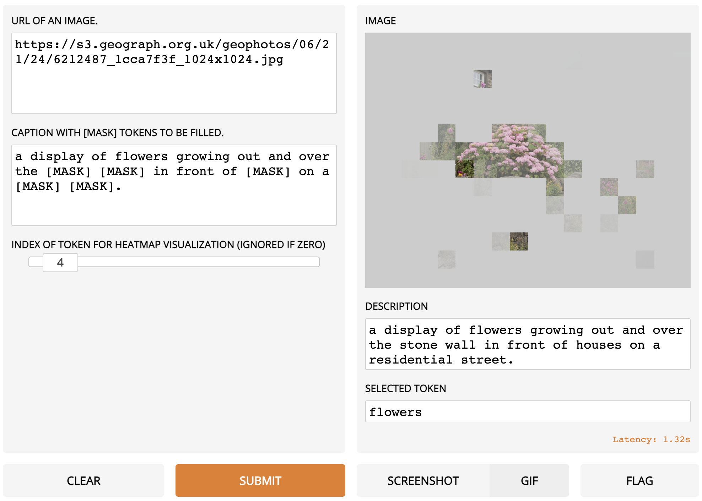
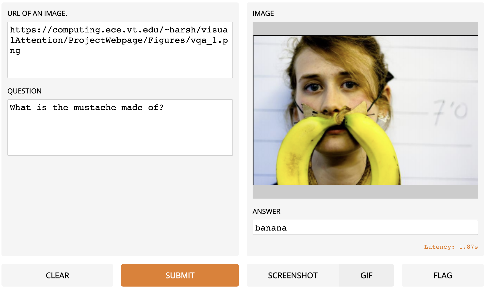

# ViLT

Code for the ICML 2021 (long talk) paper: "[ViLT: Vision-and-Language Transformer Without Convolution or Region Supervision](https://arxiv.org/abs/2102.03334)"

---
<p align="center">
  
</p>

## Install
```bash
pip install -r requirements.txt
pip install -e .
```

## Download Pretrained Weights
We provide five pretrained weights
1. ViLT-B/32 Pretrained with MLM+ITM for 200k steps on GCC+SBU+COCO+VG (ViLT-B/32 200k) [link](https://github.com/dandelin/ViLT/releases/download/200k/vilt_200k_mlm_itm.ckpt)
2. ViLT-B/32 200k finetuned on VQAv2 [link](https://github.com/dandelin/ViLT/releases/download/200k/vilt_vqa.ckpt)
3. ViLT-B/32 200k finetuned on NLVR2 [link](https://github.com/dandelin/ViLT/releases/download/200k/vilt_nlvr2.ckpt)
4. ViLT-B/32 200k finetuned on COCO IR/TR [link](https://github.com/dandelin/ViLT/releases/download/200k/vilt_irtr_coco.ckpt)
5. ViLT-B/32 200k finetuned on F30K IR/TR [link](https://github.com/dandelin/ViLT/releases/download/200k/vilt_irtr_f30k.ckpt)

## Out-of-the-box MLM + Visualization Demo
<p align="center">
  
</p>

```bash
pip install gradio==1.6.4
python demo.py with num_gpus=<0 if you have no gpus else 1> load_path="<YOUR_WEIGHT_ROOT>/vilt_200k_mlm_itm.ckpt"

ex)
python demo.py with num_gpus=0 load_path="weights/vilt_200k_mlm_itm.ckpt"
```

## Out-of-the-box VQA Demo
<p align="center">
  
</p>

```bash
pip install gradio==1.6.4
python demo_vqa.py with num_gpus=<0 if you have no gpus else 1> load_path="<YOUR_WEIGHT_ROOT>/vilt_vqa.ckpt" test_only=True

ex)
python demo_vqa.py with num_gpus=0 load_path="weights/vilt_vqa.ckpt" test_only=True
```

## Dataset Preparation
See [`DATA.md`](DATA.md)

## Train New Models
See [`TRAIN.md`](TRAIN.md)

## Evaluation
See [`EVAL.md`](EVAL.md)

## Citation
If you use any part of this code and pretrained weights for your own purpose, please cite our [paper](https://arxiv.org/abs/2102.03334).
```
@InProceedings{pmlr-v139-kim21k,
  title = 	 {ViLT: Vision-and-Language Transformer Without Convolution or Region Supervision},
  author =       {Kim, Wonjae and Son, Bokyung and Kim, Ildoo},
  booktitle = 	 {Proceedings of the 38th International Conference on Machine Learning},
  pages = 	 {5583--5594},
  year = 	 {2021},
  editor = 	 {Meila, Marina and Zhang, Tong},
  volume = 	 {139},
  series = 	 {Proceedings of Machine Learning Research},
  month = 	 {18--24 Jul},
  publisher =    {PMLR},
  pdf = 	 {http://proceedings.mlr.press/v139/kim21k/kim21k.pdf},
  url = 	 {http://proceedings.mlr.press/v139/kim21k.html},
  abstract = 	 {Vision-and-Language Pre-training (VLP) has improved performance on various joint vision-and-language downstream tasks. Current approaches to VLP heavily rely on image feature extraction processes, most of which involve region supervision (e.g., object detection) and the convolutional architecture (e.g., ResNet). Although disregarded in the literature, we find it problematic in terms of both (1) efficiency/speed, that simply extracting input features requires much more computation than the multimodal interaction steps; and (2) expressive power, as it is upper bounded to the expressive power of the visual embedder and its predefined visual vocabulary. In this paper, we present a minimal VLP model, Vision-and-Language Transformer (ViLT), monolithic in the sense that the processing of visual inputs is drastically simplified to just the same convolution-free manner that we process textual inputs. We show that ViLT is up to tens of times faster than previous VLP models, yet with competitive or better downstream task performance. Our code and pre-trained weights are available at https://github.com/dandelin/vilt.}
}
```

## Contact for Issues
- [Wonjae Kim](https://wonjae.kim/)
- [Bokyung Son](https://bo-son.github.io/)
- [Ildoo Kim](https://www.linkedin.com/in/ildoo-kim-56962034/)
