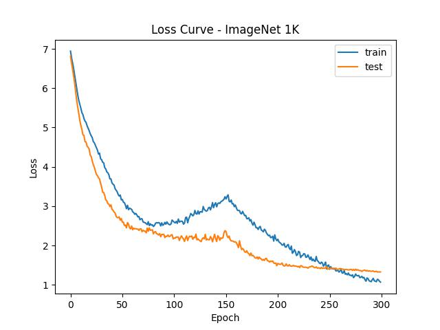
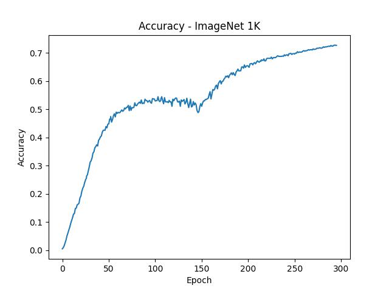

# Overview

A common way to speed up AI model training is to implement large-batch training with the help of data parallelism, but this requires expensive supercomputer clusters. In this example, we used a small server with only 4 GPUs to reproduce the large-scale pre-training of Vision Transformer (ViT) on ImageNet-1K in 14 hours.

# How to run

On a single server, you can directly use torch.distributed to start pre-training on multiple GPUs in parallel. In Colossal-AI, we provided several launch methods to init the distributed backend. You can use `colossalai.launch` and `colossalai.get_default_parser` to pass the parameters via command line. If you happen to use launchers such as SLURM, OpenMPI and PyTorch launch utility, you can use `colossalai.launch_from_<torch/slurm/openmpi>` to read rank and world size from the environment variables directly for convenience. In this example, we use `launch_from_slurm` for demo purpose. You can check out more information about SLURM [here](https://slurm.schedmd.com/documentation.html).

```shell
HOST=<node name> srun bash ./scripts/train_slurm.sh
```

---

If you are using `colossalai.launch`, do this:
In your training script:
```python
# initialize distributed setting
parser = colossalai.get_default_parser()
args = parser.parse_args()
colossalai.launch(config=args.config,
                    rank=args.rank,
                    world_size=args.world_size,
                    host=args.host,
                    port=args.port,
                    backend=args.backend
                    )
```

In your terminal:
```shell
<some_launcher> python train.py --config ./config.py --rank <rank> --world_size <world_size> --host <node name> --port 29500
```
---
If you are using `colossalai.launch_from_torch`, do this:
In your training script:

```python
# initialize distributed setting
parser = colossalai.get_default_parser()
args = parser.parse_args()
colossalai.launch_from_torch(config=args.config)
```

In your terminal
```shell
python -m torch.distributed.launch --nproc_per_node <world_size> train.py --config ./config.py --host <node name> --port 29500
```

# Experiments
To facilitate more people to reproduce the experiments with large-scale data parallel, we pre-trained ViT-Base/32 in only 14.58 hours on a small server with 4 NVIDIA A100 GPUs using ImageNet-1K dataset with batch size 32K for 300 epochs maintaining accuracy. For more complex pre-training of ViT-Base/16 and ViT-Large/32, it also takes only 78.58 hours and 37.83 hours to complete. Since the server used in this example is not a standard NVIDIA DGX A100 supercomputing unit, perhaps a better acceleration can be obtained on more professional hardware.




As can be seen from the above figure, the ViT model eventually converges well after training 300 epochs. It is worth noting that, unlike the common small-batch training convergence process, the model performance has a temporary decline in the middle of the large-batch training process. This is due to the difficulty of convergence in large-batch training. As the number of iterations is reduced, a larger learning rate is needed to ensure the final convergence. Since we did not carefully adjust the parameters, perhaps other parameter settings could get better convergence.

# Details
`config.py`

This is a [configuration file](https://colossalai.org/config.html) that defines hyperparameters and trainign scheme (fp16, gradient accumulation, etc.). The config content can be accessed through `gpc.config` in the program.

In this example, we trained ViT-Base/16 for 300 epochs on the ImageNet-1K dataset. The batch size is expanded to 32K through data parallelism. Since only 4 A100 GPUs on one small server are used, and the GPU memory is limited, the batch size of 32K cannot be used directly. Therefore, the batch size used on each GPU is only 256, and the 256 batch size is equivalently expanded to 8K through gradient accumulation 32 times. Finally, data parallelism is used between 4 GPUs to achieve an equivalent batch size of 32K.

Since the batch size of 32K far exceeds the use range of common optimizers and is difficult to train, we use the large-batch optimizer [LAMB](https://arxiv.org/abs/1904.00962) provided by Colossal-AI to achieve a better convergence. The learning rate and weight decay of [LAMB](https://arxiv.org/abs/1904.00962) are set to 1.8e-2 and 0.1, respectively. The learning rate scheduler uses a linear warmup strategy of 150 epochs. We also used FP16 mixed precision to speed up the training process, and introduced gradient clipping to help convergence. For simplicity and speed, we only use [Mixup](https://arxiv.org/abs/1710.09412) instead of `RandAug` in data augmentation.

By tuning the parallelism, this example can be quickly deployed to a single server with several GPUs or to a large cluster with lots of nodes and GPUs. If there are enough computing resources to allow data parallel to be directly extended to hundreds or even thousands of GPUs, the training process of several days on a single A100 GPU can be shortened to less than half an hour.

`imagenet_dali_dataloader.py`

To accelerate the training process, we use [DALI](https://github.com/NVIDIA/DALI) to read data and require the dataset to be in TFRecord format, which avoids directly reading a large number of raw image files and being limited by the efficiency of the file system.

`train.py`

We call DALI in this file to read data and start the training process using Colossal-AI.

`mixup.py`

Since Mixup is used as data augmentation, we define the loss function of Mixup here.

`myhooks.py`
We define hook functions that record running information to help debugging.

# How to build TFRecords dataset

As we use [DALI](https://github.com/NVIDIA/DALI) to read data, we use the TFRecords dataset instead of raw Imagenet dataset. If you don't have TFRecords dataset, follow [imagenet-tools](https://github.com/ver217/imagenet-tools) to build one.